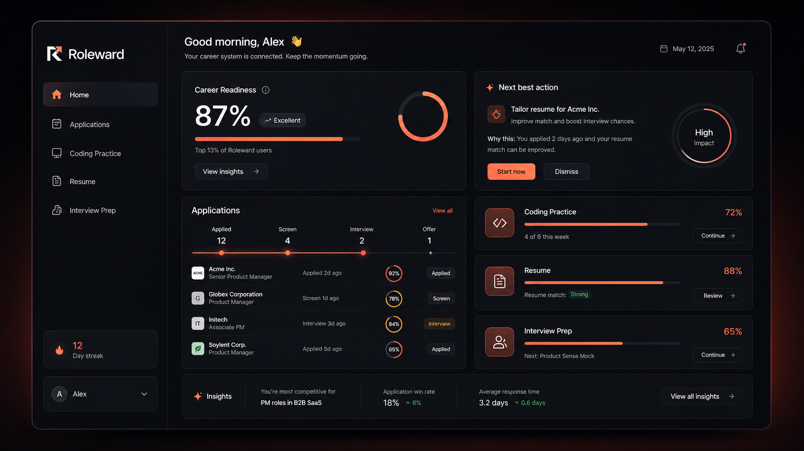
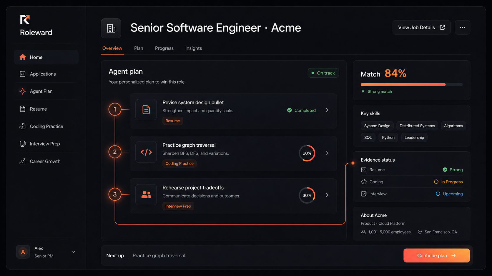

<div align="center">
  <a href="https://roleward.org">
    
  </a>

# Roleward

**Your entire job search. One contextualized AI workspace.**

Roleward connects job applications, AI resume tailoring, coding interview
practice, and mock interviews so every recommendation understands the role you
want and the work you have already completed.

[Open Roleward](https://roleward.org) · [How it works](https://roleward.org/how-it-works) · [Pricing](https://roleward.org/pricing)
</div>

> [!NOTE]
> **The Roleward source code is private.** This repository is a public showcase
> containing only documentation and screenshots. Code access is available to
> recruiters and hiring teams on request.

---

## Use Roleward

Roleward is a product for software engineers like you! Available at **[roleward.org](https://roleward.org)**.

This repository is the public showcase for Roleward. The application source
lives in a private repository; nothing here is an open-source distribution, no
license is granted, and self-hosted deployments are not supported. To use
Roleward, create an account through the official website.

## One place for the work behind the offer

<p align="center">
  <a href="https://roleward.org">
    
  </a>
</p>

Most job searches are scattered across application trackers, resume files,
coding platforms, and interview notes. Roleward brings those workflows into one
career preparation system with shared context.

```text
Target job + applications + verified experience
                       ↓
              shared career context
                       ↓
   resume tailoring · coding · mock interviews
                       ↓
               one useful action next
```

## What Roleward connects

| Workspace          | What it helps you do                                                                                                                                     |
| ------------------ | -------------------------------------------------------------------------------------------------------------------------------------------------------- |
| **Applications**   | Import a posting from a link or paste, confirm the requirements read from it, track progress, and keep preparation attached to the correct opportunity.  |
| **Resume Kitchen** | Import a resume, confirm what was read from it, then tailor the whole document — or one experience, or one bullet — to a specific role and export a PDF. |
| **Zed**            | Practice on generated or imported LeetCode-style problems, run real tests against your code, and request progressive hints instead of answers.           |
| **Stage Fright**   | Run behavioral, recruiter, coding, system design, PM case, and resume deep-dive mock interviews in text or live voice.                                   |
| **Moxie**          | Ask an assistant that can see the whole workspace, answers with linked citations, and remembers only what you approve.                                   |
| **Portfolio**      | Publish a public page built strictly from confirmed experience, at a handle derived from your name.                                                      |
| **Readiness plan** | Connect activity across every workspace and surface the highest-value preparation step for the target role.                                              |

## One role, one preparation route

<p align="center">
  <a href="https://roleward.org/how-it-works">
    
  </a>
</p>

Roleward keeps the target job at the center. Resume revisions close specific
evidence gaps, coding sessions focus on relevant patterns, and interview
practice draws from the decisions and outcomes the candidate can actually
defend.

---

## Engineering highlights

The interesting problems in Roleward are mostly the same problem: an LLM is
useful and an LLM is not trustworthy, so every generated artifact is checked by
something deterministic before a candidate ever sees it.

### Resume generation that cannot invent a credential

A confirmed resume claim becomes "verified background" — it feeds interview
questions, coding context, and tailored bullets. So an embellishment here is not
a bad suggestion, it is a fabricated credential the candidate has personally
signed off on and has to defend in the room.

- **Quote-checked extraction.** Every claim read out of an uploaded PDF or DOCX
  must quote the source document, and the quote is verified against the
  extracted text. Matching is whitespace-insensitive with an ordered-word
  fallback, because PDF extraction breaks words across lines — an earlier
  whitespace-sensitive check discarded 8 of 17 valid claims on a real resume.
- **Number grounding.** A claim asserting `38%` is dropped unless `38` appears in
  the line it cites. The same check runs again on every rewrite, against the
  original bullet plus whatever extra context the candidate supplied for that
  run. Unsupported rewrites are discarded, never softened, never shown with a
  warning — a warning next to a plausible sentence is not a control.
- **Structure-locked tailoring.** Whole-resume tailoring hands the model the
  resume as opaque item and bullet ids and asks for a replacement string per id.
  The result is rebuilt by walking the _original_, so a bullet the model drops,
  merges, renames, or invents changes nothing. Entries, order, and bullet count
  are guaranteed by construction rather than by prompt.
- **Scoped rewrites.** Candidates can tailor everything, one experience, or
  individual bullets. Out-of-scope bullets are still sent to the model as
  read-only context so rewrites do not duplicate neighbouring lines, and the
  merge layer refuses to change them whatever comes back.
- **Deterministic scoring.** Resume scoring is rules, not a model call. "Rate
  this out of ten" produces a number nobody can act on that changes between
  runs; every point here is tied to a specific line, so the score doubles as the
  to-do list.
- **PDF export.** Tailored resumes render to a single-column, standard-font,
  real-text PDF built with `pdf-lib` — the layout an applicant tracking system
  can actually parse — with section order read off the candidate's own resume
  rather than imposed by a template.

### Self-validating coding problem generation

Generated practice problems are worthless if the expected outputs are wrong.
Live testing showed the model confidently mispredicting its own canonical
solution's output on 3–4 of 8 cases, so it is never asked what its code returns.

- **The model supplies inputs; outputs are derived by execution.**
- **Differential testing.** Every draft ships a canonical solution, an
  independent brute-force solution, and a random input generator. The two
  implementations must agree across **60 randomized trials** before either is
  trusted to produce expected outputs. Disagreement rejects the problem.
- **Arity repair.** A function taking one `int[]` should receive `[[1,3,5]]`, and
  models routinely write `[1,3,5]`. The unambiguous single-parameter case is
  repaired; anything genuinely ambiguous is rejected cheaply, before either
  judge round trip is paid for.
- **Warm pool.** A validated problem costs one model call plus two judge round
  trips — 11 to 28 seconds — far too slow to sit behind a click. Problems are
  generated ahead of time into a pool keyed by archetype and difficulty, with
  per-candidate "seen" tracking so a full pool still refills when one person has
  worked through it. A request becomes a read.
- **30 algorithmic archetypes**, from sliding window and monotonic deque through
  bitmask DP, Dijkstra, and union-find.

### A sandboxed judge for untrusted code

- Candidate code runs on AWS Lambda, where the per-invocation Firecracker
  microVM is the real security boundary.
- Inside it, every batch is handed to a **short-lived subprocess**, so an
  infinite loop, a crash, or an allocation storm takes down only the child.
- Wall-clock limits via `SIGALRM`, address-space limits via `RLIMIT_AS`
  (4s / 256MB by default), stdout captured rather than leaked.
- Tolerant equality: float epsilon comparison, tuple/list collapsing, set
  normalization, and class-based `Solution` submissions resolved automatically.
- The execution layer sits behind a **provider-agnostic port**, so nothing above
  it knows whether code runs on Lambda, a self-hosted judge, or a local stub.

### Live voice interviews without recording anyone

- **WebRTC** peer connection straight from the browser to the OpenAI Realtime
  API, with ephemeral tokens minted server-side so the API key never reaches the
  client.
- **Delivery metrics computed in the browser.** Speaking time, silence, pause
  count, longest pause, mean energy, and energy variation are derived from the
  live microphone stream frame by frame. The audio is discarded as it plays —
  only the numbers leave the page, so the product measures delivery without
  introducing voice retention.
- Coding interviews stream an edit-log digest into the conversation as side
  context, so the interviewer can react to what the candidate is typing.
- **6 interview types** across two modalities, each with its own persona, rubric
  dimensions, and turn budget.

### Job posting ingestion

- Dedicated adapters for **Greenhouse, Lever, Ashby, Workday, and Phenom**, with
  JSON-LD `JobPosting` extraction and a scored heuristic for everything else,
  falling back to headless **Playwright** rendering for postings that only exist
  after JavaScript runs.
- **SSRF guard** on every fetch: loopback, private, link-local (including
  `169.254.0.0/16` cloud metadata), carrier-grade NAT, benchmarking, multicast,
  and their IPv6 equivalents are all refused before a request is made.

### Workspace assistant with an auditable memory

- Moxie answers with a **typed block contract** — paragraphs, plans, tables,
  coaching, drafts — rather than markers embedded in prose, so rendering does not
  depend on the model formatting fences correctly.
- Grounded sentences carry **citation markers** that render as chips linking back
  to the exact workspace surface a claim came from.
- Durable memories and goals are **proposals until the user approves them**, and
  removal is a soft delete so the record stays auditable. Nothing is captured
  silently.

### Persistence and identity

- **DynamoDB single-table** storage with optimistic concurrency on a version
  counter, behind a local-first workspace that syncs rather than blocks.
- **NextAuth v5** with AWS Cognito (hosted OAuth plus credentials) and GitHub,
  presigned S3 uploads, and a derived-not-chosen portfolio handle with a reserved
  namespace so handles outlive their URL scheme.

## Stack

**Next.js 16** (App Router, React 19, Server Components) · **TypeScript** ·
**Tailwind CSS 4** · **Zod** · **OpenAI** (chat, structured outputs, Realtime) ·
**AWS** (Lambda, DynamoDB, S3, Cognito) · **Python** (judge, job importer) ·
**FastAPI** + **Playwright** + **BeautifulSoup** · **Vitest** · **Playwright E2E**

## By the numbers

|                   |                                                          |
| ----------------- | -------------------------------------------------------- |
| Application code  | ~34,700 lines of TypeScript / TSX                        |
| Test suite        | 324 tests across 47 files, ~4,500 lines                  |
| Python services   | ~1,300 lines (sandboxed judge, ATS importer)             |
| Surface           | 42 pages, 30 API route handlers, 63 React components     |
| Domain modules    | 17                                                       |
| Coding archetypes | 30                                                       |
| Editor languages  | 10 (Python executable end to end)                        |
| ATS integrations  | 5 dedicated adapters, plus JSON-LD and generic fallbacks |

## Source and authorship

Roleward was designed and built by **[Aman Sriven](https://github.com/amansriven)**.
The source code is kept in a private repository.

|                    |                                         |
| ------------------ | --------------------------------------- |
| Private repository | `amansriven/Roleward`                   |
| Commits            | 75, all authored by Aman Sriven         |
| Development        | August 14 – August 27, 2026             |
| Live product       | [roleward.org](https://roleward.org)    |

**Code review on request.** Recruiters and hiring teams can be granted
read-only access to the private repository. Reach out via
[amansriven.com](https://www.amansriven.com/gh).

## Product principles

- **Evidence before generation.** Resume suggestions use experience the
  candidate has confirmed.
- **Keep the original.** Imported resumes remain intact while tailored versions
  are created separately.
- **Check the model, do not trust it.** Anything checkable — a quote, a number,
  a test result, a document's structure — is verified in code before a candidate
  sees it.
- **Coach rather than answer.** Coding and interview tools strengthen reasoning,
  communication, and delivery.
- **Explain the next step.** Preparation guidance shows why an action matters to
  the target role.
- **One target, shared context.** Applications, resumes, coding practice, and
  mock interviews contribute to the same preparation route.

---

<div align="center">
  <strong>Move forward. Go further.</strong><br />
  <a href="https://roleward.org">roleward.org</a>
</div>
